# Лабораторная работа 6. Создание внутренней формы представления программы

## Название работы и ФИО автора

- **Работа:** Создание внутренней формы представления программы
- **Автор:** Александр (АВТ-314)

## Цель работы

Изучить методы построения внутреннего представления программы (ВПП) на основе контекстно-свободной грамматики, реализовать синтаксический анализ методом рекурсивного спуска и преобразовать арифметические выражения в тетрады и ПОЛИЗ.

## Вариант задания

- **Вариант:** 10
- **Язык:** Python (арифметические выражения)

### Полное определение КС-грамматики

```text
E -> T A
A -> eps | + T A | - T A
T -> F B
B -> eps | * F B | / F B | // F B | % F B | ** F B
F -> num | id | (E)
id -> letter {letter | digit | _}
num -> digit {digit}
```

### Примеры корректных строк

- `a + b * c`
- `(x + 12) // y - z % 3`
- `2 + 3 * (4 - 1) ** 2`
- `100 // (5 + 5) + 7`

## Реализация

Основная реализация находится в файле `lab6_expression_analyzer.py`.

Реализованы:

1. **Лексический анализ**
   - выделение `id`, `num`, операторов `+ - * / // % **`, скобок;
   - фиксация лексических ошибок:
     - недопустимый символ;
     - недопустимый идентификатор, начинающийся с цифры.

2. **Синтаксический анализ (рекурсивный спуск)**
   - функции соответствуют правилам грамматики: `E`, `A`, `T`, `B`, `F`;
   - фиксируются синтаксические ошибки:
     - пропущенный операнд;
     - лишняя закрывающая скобка;
     - пропущенная закрывающая скобка;
     - лишние символы после корректного выражения.

3. **Внутреннее представление в виде тетрад**
   - при успешном синтаксическом разборе генерируются тетрады вида:
     - `(op, arg1, arg2, result)`;
   - используются временные переменные `t1`, `t2`, ...

4. **ПОЛИЗ и вычисление**
   - ПОЛИЗ строится алгоритмом Дейкстры (shunting-yard);
   - приоритет операций:
     - `**` (правоассоциативно),
     - `* / // %`,
     - `+ -`;
   - вычисление выполняется **только для выражений из целых чисел** (без `id`).

## Диаграмма лексера (текстовая схема)

```text
START
  |-- digit --------> NUM (digit*)
  |-- letter/_ -----> ID  (letter|digit|_)*
  |-- '+' '-' '*' '/' '%' '//' '**' -> OP
  |-- '(' ----------> LPAREN
  |-- ')' ----------> RPAREN
  |-- whitespace ---> skip
  '-- other --------> LEX_ERROR
```

## Схема рекурсивного спуска для парсера

```text
parse:
  E
  expect EOF

E:
  T
  A

A:
  if '+' or '-':
     T
     emit quad
     A
  else eps

T:
  F
  B

B:
  if '*', '/', '//', '%', '**':
     F
     emit quad
     B
  else eps

F:
  num | id | '(' E ')'
```

## Тестовые примеры (для скриншотов в отчете)

### 1) Корректная строка (тетрады + ПОЛИЗ)

Вход:

```text
2 + 3 * (4 - 1)
```

Ожидается:

- успешный лексический и синтаксический анализ;
- таблица тетрад;
- ПОЛИЗ;
- вычисленное значение.

### 2) Лексическая ошибка

Вход:

```text
a + @b
```

Ожидается:

- сообщение о недопустимом символе `@`;
- предупреждение, что тетрады и ПОЛИЗ не строятся.

### 3) Синтаксическая ошибка: пропущенный операнд

Вход:

```text
5 + * 2
```

Ожидается:

- сообщение о пропущенном операнде;
- тетрады и ПОЛИЗ не строятся.

### 4) Синтаксическая ошибка: лишняя скобка

Вход:

```text
7 + 3)
```

Ожидается:

- сообщение о лишней закрывающей скобке или лишнем фрагменте;
- тетрады и ПОЛИЗ не строятся.

## Скриншоты для отчета

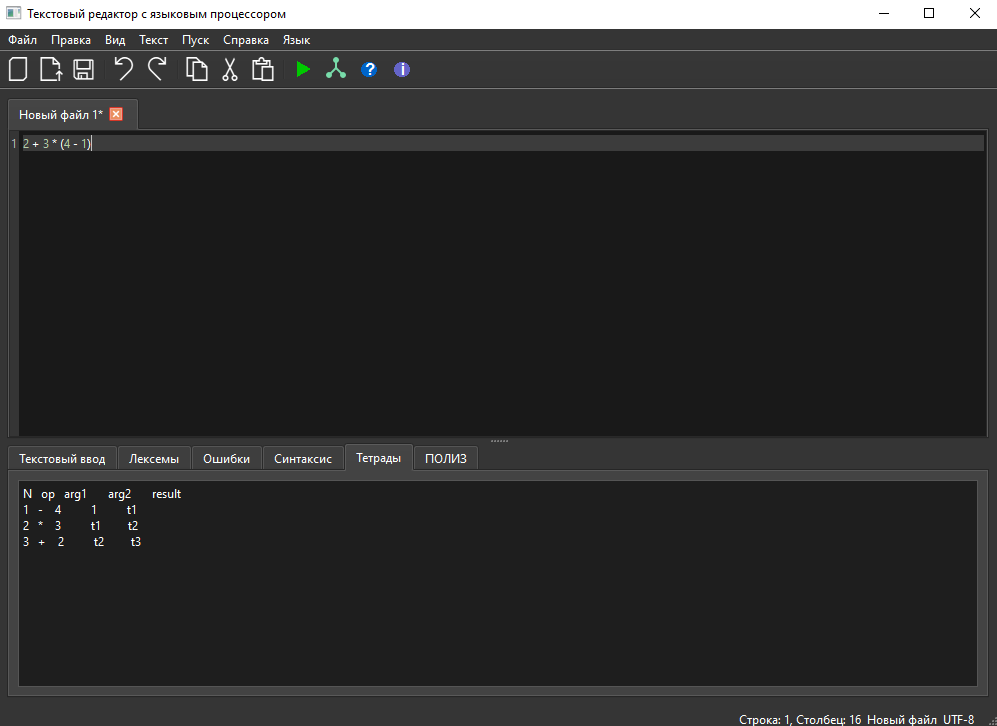

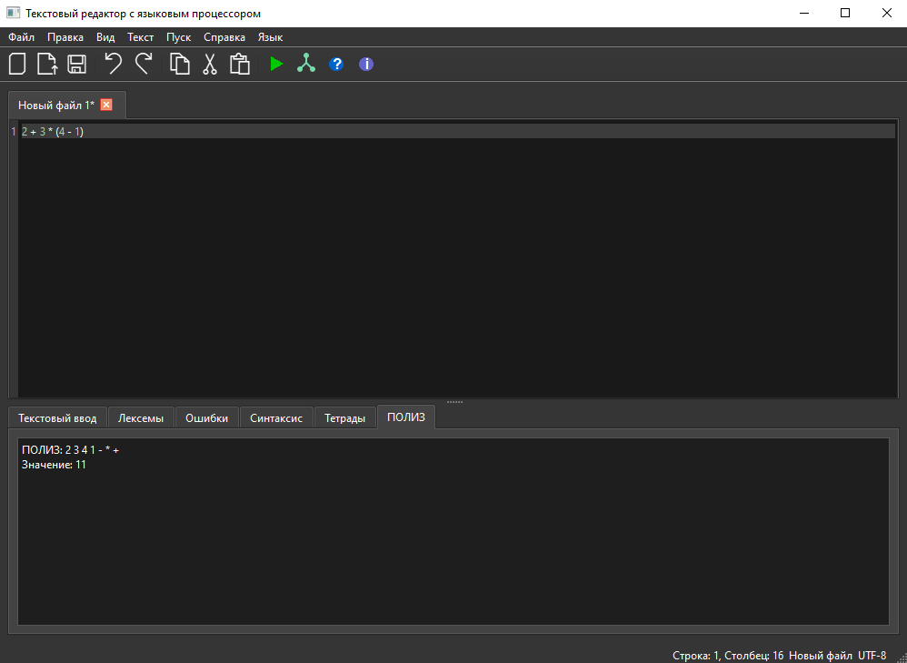

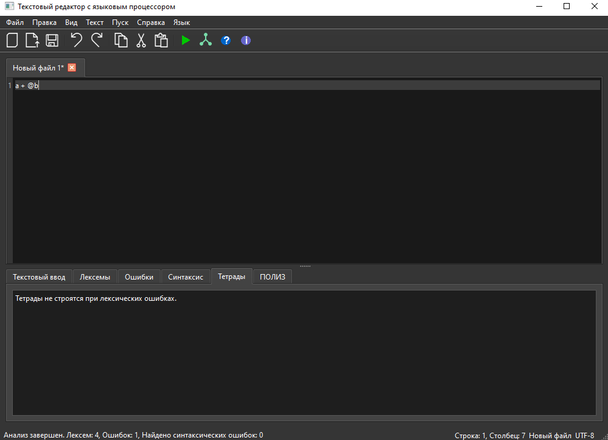

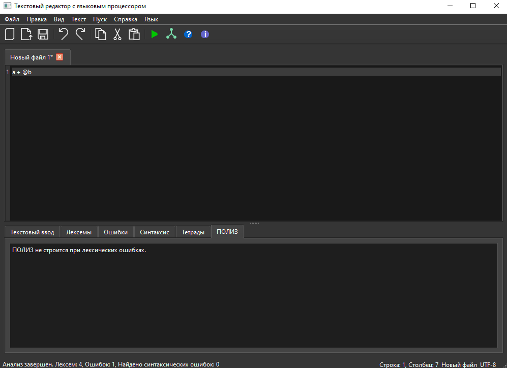

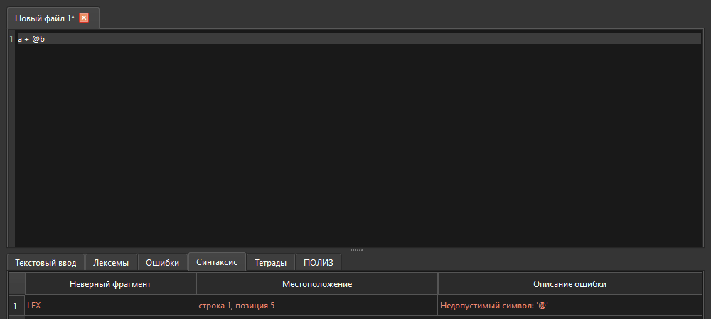

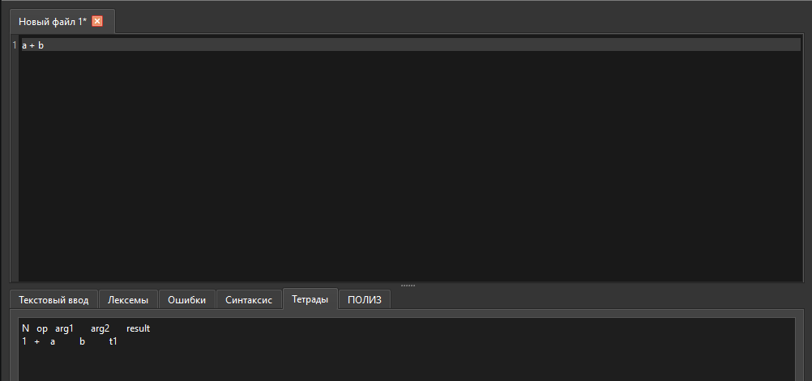

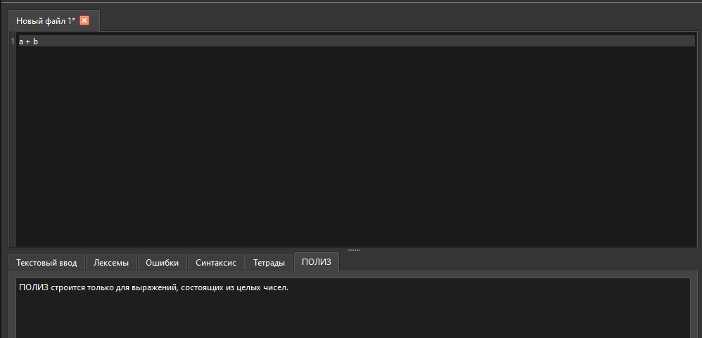

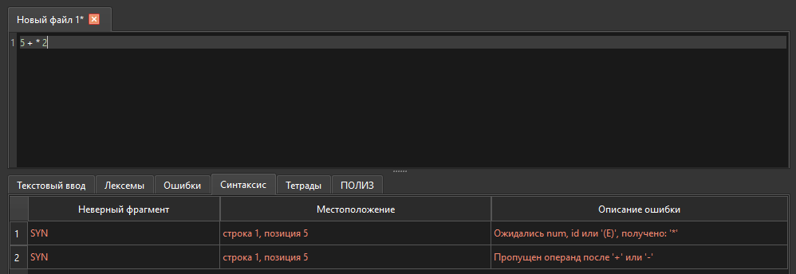

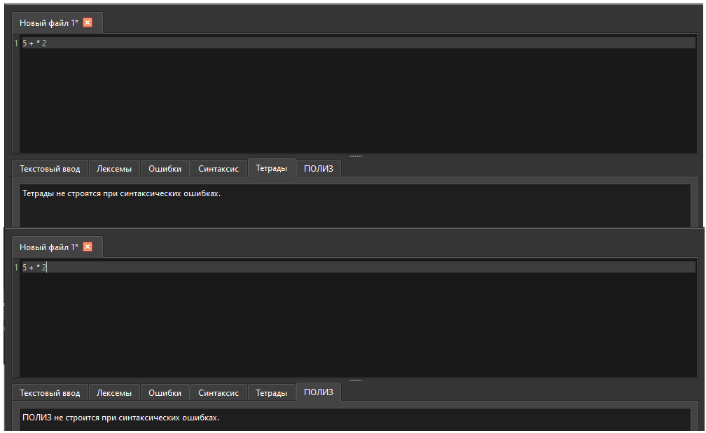

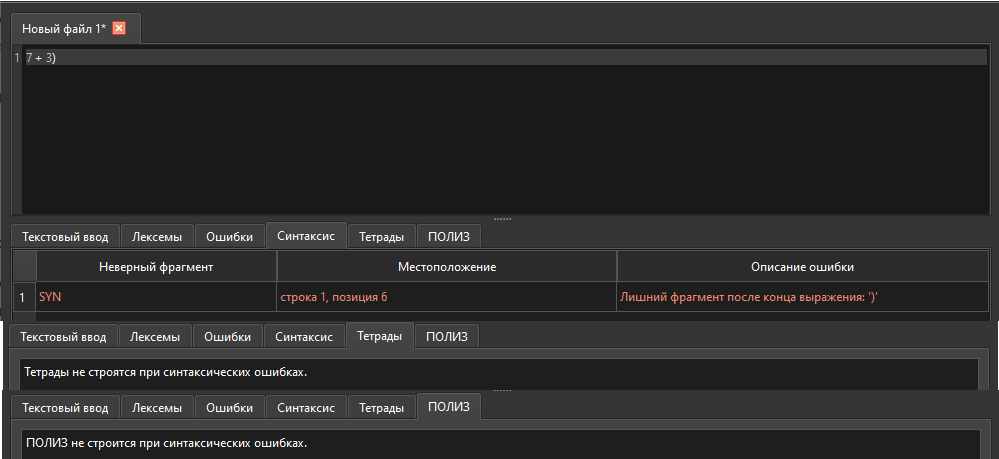

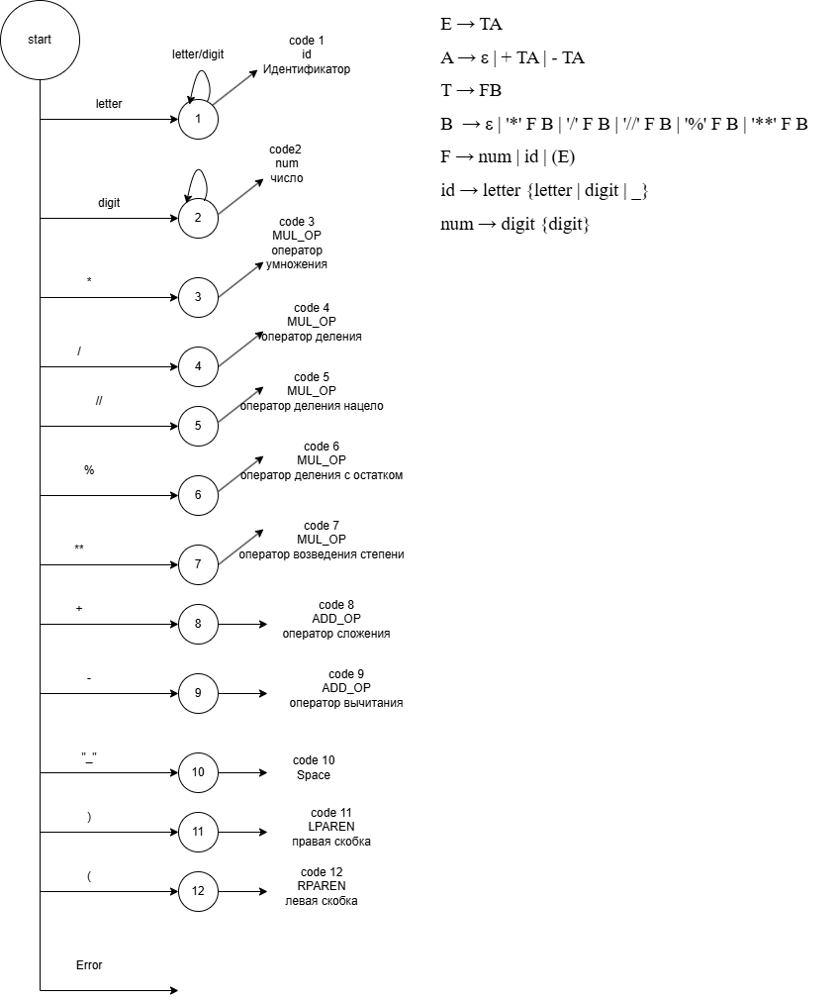

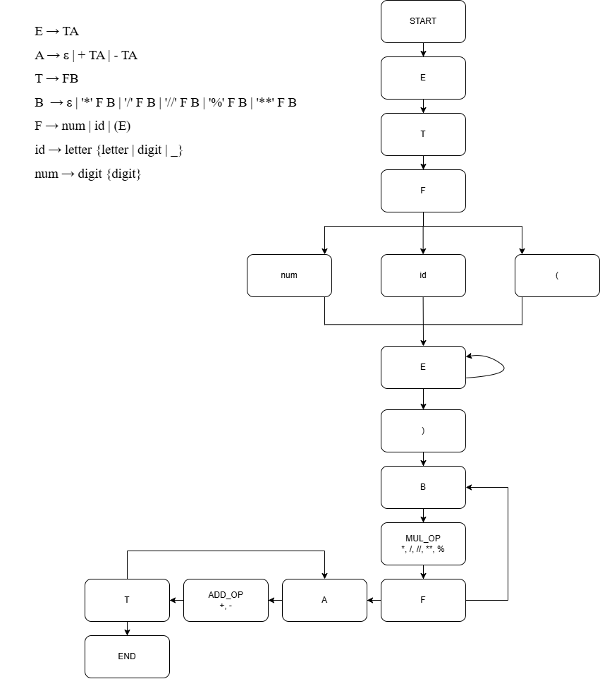


## Запуск

```bash
python main.py
```

После запуска введите выражение в одну строку.
